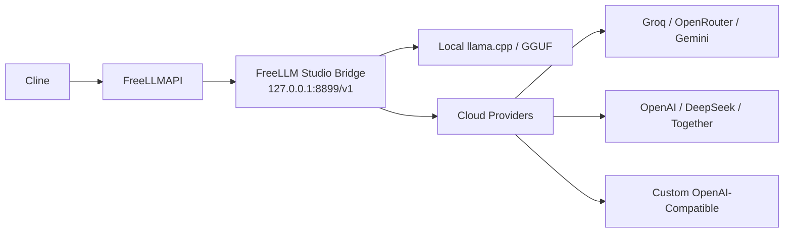

# FreeLLM Studio — University Project

> **Python Desktop Manager for FreeLLMAPI, Local LLMs, Cloud API Providers & Cline**

این مخزن نسخه نهایی پروژه دانشگاهی **FreeLLMAPI** است.  
پروژه در دو بخش انجام شده است:

1. **بررسی و راه‌اندازی FreeLLMAPI**، مدیریت Providerها، Fallback و اتصال به `Cline` در `VS Code`.
2. **طراحی و توسعه FreeLLM Studio با Python/PySide6** برای اجرای مدل Local، مدیریت Providerهای آنلاین، تست APIها، Chat، Bridge سازگار با OpenAI و اتصال ساده‌تر به FreeLLMAPI.

> بخش دوم، یعنی **FreeLLM Studio**، توسعه اختصاصی این Repository است و سورس اجرایی آن در فایل `app.py` قرار دارد.

**درس:** پروژه نرم‌افزار  
**دانشگاه:** دانشگاه آزاد اسلامی واحد تهران مرکزی  
**ترم:** تابستان 4043  
**نسخه نرم‌افزار:** 1.2.1

---

## دانلود و اجرای سریع

### دانلود سورس کامل

[⬇️ **دانلود نسخه کامل پروژه به‌صورت ZIP**](https://github.com/Amir200382/freellmapi-university-project/archive/refs/heads/main.zip)

یا از بالای صفحه GitHub:

```text
Code → Download ZIP
```

### اجرای پروژه

پس از دانلود:

1. فایل ZIP را `Extract` کنید.
2. وارد پوشه استخراج‌شده شوید.
3. فایل زیر را اجرا کنید:

```text
START.cmd
```

4. در اجرای اول، برنامه به‌صورت خودکار:
   - یک Virtual Environment مستقل با نام `.venv` می‌سازد.
   - وابستگی‌های Python را از `requirements.txt` نصب می‌کند.
   - برنامه اصلی را اجرا می‌کند.
5. در اجراهای بعدی، برنامه مستقیماً باز می‌شود.

### پیش‌نیاز

روی Windows فقط **Python 3.10 یا جدیدتر** نیاز است.

هنگام نصب Python بهتر است گزینه زیر فعال باشد:

```text
Add Python to PATH
```

---

# بخش اصلی پروژه — FreeLLM Studio

`FreeLLM Studio` یک نرم‌افزار Desktop است که با **Python و PySide6** توسعه داده شده و هدف آن یکپارچه‌سازی اجرای مدل Local و استفاده از API Providerهای مختلف در یک رابط واحد است.

### امکانات اصلی

- رابط گرافیکی Desktop با `PySide6`
- اجرای مدل Local با `llama.cpp`
- پشتیبانی از مدل‌های `GGUF`
- دانلود Runtime فقط در صورت نیاز
- دانلود مدل Lite فقط در صورت نیاز
- Chat داخلی
- مدیریت API Providerهای مختلف
- دریافت خودکار لیست Modelها
- تست واقعی اتصال Provider
- انتخاب Provider فعال
- OpenAI-Compatible Bridge
- اتصال به FreeLLMAPI و Cline
- Diagnostics و Log
- تنظیمات Network / Proxy / VPN
- عدم ذخیره API Key داخل GitHub
- عدم نیاز به Docker برای اجرای خود FreeLLM Studio و مدل Local

Providerهای موجود در نسخه فعلی:

```text
Local Model
Groq
OpenRouter
Gemini
OpenAI
DeepSeek
Together
Custom
```

---

# راهنمای ارزیابی و تست پروژه

برای بررسی پروژه دو روش اصلی وجود دارد.

---

## روش اول — اجرای Local Model بدون API Key

در این حالت هیچ API Key خارجی لازم نیست.

پس از اجرای `START.cmd`:

1. از منوی سمت چپ وارد:

```text
Local Models
```

2. روی:

```text
Install runtime
```

کلیک کنید.

3. پس از نصب Runtime، روی:

```text
Download Lite model
```

کلیک کنید.

4. پس از دانلود مدل، روی:

```text
Start model
```

کلیک کنید.

5. صبر کنید وضعیت مدل به حالت آماده (`Ready`) برسد.

6. وارد بخش:

```text
Chat
```

شوید و یک پیام آزمایشی ارسال کنید.

### مدل پیش‌فرض Lite

```text
Qwen2.5-Coder-0.5B-Instruct
GGUF / Q4_K_M
```

Runtime و Model داخل Repository قرار داده نشده‌اند تا مخزن GitHub سبک باقی بماند.  
این فایل‌ها هنگام نیاز دانلود شده و در Windows داخل مسیر زیر نگهداری می‌شوند:

```text
%LOCALAPPDATA%\FreeLLMStudio\
```

### مسیر ارتباط Local

```text
FreeLLM Studio
      │
      ▼
 llama.cpp
      │
      ▼
 GGUF Model
```

---

## روش دوم — استفاده از Online Provider با API Key

برای تست بخش Providerهای آنلاین، **API Key آزمایشی به‌صورت خصوصی در اختیار استاد قرار داده می‌شود**.

> API Key عمداً داخل GitHub قرار داده نشده است تا اطلاعات محرمانه در Repository عمومی منتشر نشود.

پس از دریافت API Key:

1. برنامه را با `START.cmd` اجرا کنید.
2. از منوی سمت چپ وارد:

```text
API Providers
```

شوید.

3. Provider مربوط به API Key ارسال‌شده را انتخاب کنید.

برای مثال اگر API Key مربوط به Groq باشد:

```text
Groq
```

را انتخاب کنید.

4. API Key را در فیلد مربوطه وارد کنید.
5. روی:

```text
Fetch models
```

کلیک کنید.

6. یکی از Modelهای دریافت‌شده را انتخاب کنید.
7. روی:

```text
Test
```

کلیک کنید.

8. اگر Test موفق باشد، Provider آماده استفاده است.
9. در صورت نیاز روی:

```text
Set active
```

کلیک کنید.
10. وارد بخش `Chat` شوید و Provider مربوطه را انتخاب کنید.
11. یک پیام آزمایشی ارسال کنید.

اگر پاسخ دریافت شود، ارتباط با Provider آنلاین با موفقیت برقرار شده است.

### مسیر ارتباط Provider آنلاین

```text
FreeLLM Studio
      │
      ▼
 Provider API
      │
      ├── Groq
      ├── OpenRouter
      ├── Gemini
      ├── OpenAI
      ├── DeepSeek
      ├── Together
      └── Custom
```

---

# تفاوت Local و Online Provider

| ویژگی | Local Model | Online Provider |
|---|---|---|
| نیاز به API Key | خیر | بله |
| محل اجرای مدل | سیستم کاربر | سرور Provider |
| نیاز به اینترنت بعد از دانلود مدل | خیر | بله |
| نیاز به Runtime | بله | خیر |
| مدل GGUF | بله | خیر |
| Fetch Models | خیر | بله |
| Test Connection | Local health/inference | API واقعی Provider |

---

# OpenAI-Compatible Bridge

FreeLLM Studio یک Bridge محلی سازگار با OpenAI ارائه می‌دهد.

پیش‌فرض:

```text
Base URL:
http://127.0.0.1:8899/v1
```

Bridge درخواست‌ها را به Provider فعال داخل برنامه هدایت می‌کند.

معماری کلی:



مزیت این معماری این است که Provider و Model فعال از داخل **FreeLLM Studio** قابل تغییر است و لایه‌های دیگر نیازی به تنظیم مجدد مداوم ندارند.

---

# اتصال FreeLLM Studio به FreeLLMAPI

در FreeLLMAPI می‌توان یک Provider از نوع **Custom OpenAI-Compatible** تعریف کرد.

اطلاعات Bridge در صفحه:

```text
Gateway / Cline
```

داخل FreeLLM Studio نمایش داده می‌شود.

به‌صورت پیش‌فرض Base URL:

```text
http://127.0.0.1:8899/v1
```

است.

پس از یک‌بار تنظیم FreeLLMAPI، تغییر Provider یا Model از داخل FreeLLM Studio قابل انجام است.

---

# اتصال به Cline

در بخش اول پروژه، `Cline` در `Visual Studio Code` به Unified API مربوط به FreeLLMAPI متصل می‌شود.

ساختار کلی:

```text
Cline
  │
  ▼
FreeLLMAPI
  │
  ▼
FreeLLM Studio Bridge
  │
  ├── Local Model
  └── Online Provider
```

در Cline نوع Provider باید روی حالت سازگار با OpenAI قرار بگیرد:

```text
OpenAI Compatible
```

---

# تست سریع سورس بدون دانلود Model و بدون API Key

اگر هدف فقط بررسی اجرای سورس و هسته برنامه باشد:

```text
TEST.cmd
```

را اجرا کنید.

یا از CMD/PowerShell:

```bash
python app.py --self-test
```

Self-test برای بررسی سریع بخش‌های اصلی هسته و Bridge طراحی شده و برای اجرای آن به API Key یا دانلود Model خارجی نیاز نیست.

---

# ساختار Repository

```text
freellmapi-university-project/
├── app.py
├── START.cmd
├── TEST.cmd
├── requirements.txt
├── VERSION
├── .gitignore
├── README.md
└── docs/
    ├── ARCHITECTURE.md
    ├── PROJECT_CONTEXT.md
    └── CHANGELOG.md
```

### فایل‌های اصلی

| فایل | توضیح |
|---|---|
| `app.py` | سورس اصلی FreeLLM Studio |
| `START.cmd` | ساخت محیط مجازی، نصب وابستگی‌ها و اجرای نرم‌افزار |
| `TEST.cmd` | اجرای Self-test |
| `requirements.txt` | وابستگی‌های Python |
| `docs/ARCHITECTURE.md` | معماری فنی پروژه |
| `docs/PROJECT_CONTEXT.md` | ارتباط بخش FreeLLMAPI با توسعه Python |
| `docs/CHANGELOG.md` | تغییرات نسخه‌ها |

---

# امنیت

اطلاعات زیر نباید داخل Repository عمومی Commit شوند:

```text
API Keys
.env
Tokens
Passwords
Runtime binaries
GGUF models
Logs containing secrets
```

به همین دلیل API Key مربوط به تست Provider به‌صورت خصوصی ارسال می‌شود و داخل GitHub قرار نمی‌گیرد.

همچنین فایل‌های Runtime، Model و Virtual Environment توسط `.gitignore` از Repository خارج نگه داشته شده‌اند.

---

# بخش اول پروژه — FreeLLMAPI

شروع پروژه بر پایه بررسی و اجرای FreeLLMAPI بود.

موارد بررسی‌شده:

- نصب و راه‌اندازی FreeLLMAPI
- مدیریت Providerها
- دریافت API Key از Providerهای مختلف
- بررسی Modelها
- Fallback بین Modelها
- Playground
- Unified API
- اتصال به Cline
- استفاده از OpenAI-Compatible API
- بررسی اجرای Local و Cloud

این مرحله مبنای طراحی بخش دوم پروژه یعنی **FreeLLM Studio** شد.

---

# چرا بخش Python توسعه داده شد؟

نسخه اولیه پروژه بیشتر بر نصب، تنظیم و بررسی FreeLLMAPI تمرکز داشت.

برای این‌که خروجی نهایی پروژه فقط یک Repository مستنداتی نباشد و **سورس اجرایی قابل ارزیابی** نیز در اختیار استاد قرار بگیرد، FreeLLM Studio با Python توسعه داده شد.

اهداف این توسعه:

1. ارائه سورس اجرایی مستقل
2. ساده‌تر کردن اجرای پروژه
3. کاهش مراحل نصب پراکنده
4. اجرای Local LLM بدون Docker
5. مدیریت Providerها از یک UI واحد
6. تست APIها و Modelها
7. ایجاد Bridge سازگار با OpenAI
8. امکان اتصال به FreeLLMAPI و Cline
9. امکان اجرای پروژه توسط استاد تنها با `START.cmd`

---

# ویدیوی پروژه

ویدیوی اجرای پروژه شامل مراحل FreeLLMAPI، Cline و بخش Python تهیه شده است.

لینک ویدیوی ارائه قبلی:

[▶️ مشاهده ویدیوی پروژه](https://drive.google.com/file/d/1yDVhFRk7pRmxaFJIKEIIzoiOmvJRG-IQ/preview)

---

# نکته مهم برای ارزیابی

این Repository صرفاً راهنمای نصب FreeLLMAPI نیست.

**بخش توسعه‌یافته پروژه، FreeLLM Studio، به‌صورت کامل در فایل `app.py` قرار دارد و قابل اجرا است.**

ساده‌ترین روش بررسی:

```text
Download ZIP
     ↓
Extract
     ↓
START.cmd
     ↓
FreeLLM Studio
```

سپس استاد می‌تواند یکی از این دو مسیر را بررسی کند:

```text
Local Models → Install runtime → Download Lite model → Start model → Chat
```

یا با API Key خصوصی:

```text
API Providers → Select Provider → API Key → Fetch models → Test → Chat
```

---

# مستندات بیشتر

برای جزئیات فنی:

- [`docs/ARCHITECTURE.md`](docs/ARCHITECTURE.md)
- [`docs/PROJECT_CONTEXT.md`](docs/PROJECT_CONTEXT.md)
- [`docs/CHANGELOG.md`](docs/CHANGELOG.md)

---

# اعتبار و پروژه اصلی FreeLLMAPI

FreeLLMAPI یک پروژه متن‌باز مستقل است و حقوق سورس اصلی آن متعلق به نویسندگان و مشارکت‌کنندگان همان پروژه است.

در این Repository:

- بررسی و راه‌اندازی FreeLLMAPI بخشی از پروژه دانشگاهی بوده است.
- **FreeLLM Studio و سورس Python موجود در `app.py` بخش توسعه اختصاصی این پروژه است.**

مخزن اصلی FreeLLMAPI:

https://github.com/tashfeenahmed/freellmapi
