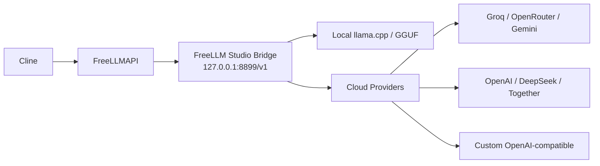

# FreeLLM Studio — University Project

> **Python Desktop Manager for FreeLLMAPI, Local LLMs, Cloud API Providers & Cline**

این مخزن نسخه‌ی نهایی پروژه‌ی دانشگاهی **FreeLLMAPI** است.  
بخش اول پروژه به بررسی و راه‌اندازی FreeLLMAPI و اتصال آن به Cline اختصاص داشت؛ اما **بخش اصلی و توسعه‌یافته‌ی پروژه** یک نرم‌افزار مستقل با Python و PySide6 است که برای مدیریت مدل لوکال، Providerهای آنلاین، Bridge سازگار با OpenAI و اتصال به FreeLLMAPI طراحی شده است.

**درس:** پروژه نرم‌افزار  
**دانشگاه:** دانشگاه آزاد اسلامی واحد تهران مرکزی  
**ترم:** تابستان 4043  
**نسخه:** FreeLLM Studio 1.2.1

[⬇️ دانلود مستقیم سورس پروژه (ZIP)](https://github.com/Amir200382/freellmapi-university-project/archive/refs/heads/main.zip)

---

## بخش اصلی پروژه: FreeLLM Studio

`FreeLLM Studio` نرم‌افزاری است که در این پروژه با **Python / PySide6** توسعه داده شده تا اجرای Local LLM و مدیریت APIهای مختلف بدون تنظیمات پراکنده انجام شود.

### امکانات اصلی

- رابط گرافیکی Desktop با PySide6
- اجرای مدل لوکال GGUF با `llama.cpp`
- دانلود Runtime و مدل سبک فقط در صورت نیاز
- پشتیبانی از:
  - Local Model
  - Groq
  - OpenRouter
  - Gemini
  - OpenAI
  - DeepSeek
  - Together
  - Custom OpenAI-compatible API
- دریافت خودکار لیست Modelها از Provider
- تست واقعی `Chat Completion`
- انتخاب Provider فعال
- Chat داخلی
- OpenAI-compatible Bridge برای اتصال به FreeLLMAPI
- صفحه Diagnostics و Log
- پشتیبانی از VPN / System Proxy / Manual Proxy
- عدم نیاز به Docker برای اجرای خود FreeLLM Studio و مدل لوکال

---

## اجرای سریع

### پیش‌نیاز

فقط **Python 3.10 یا جدیدتر** روی Windows نصب باشد و هنگام نصب Python گزینه‌ی `Add Python to PATH` فعال شده باشد.

### اجرا

1. Repository را دانلود و Extract کنید.
2. فایل زیر را اجرا کنید:

```text
START.cmd
```

3. در اجرای اول، برنامه به‌صورت خودکار:
   - یک `.venv` مستقل می‌سازد.
   - وابستگی‌ها را از `requirements.txt` نصب می‌کند.
   - نرم‌افزار را اجرا می‌کند.

در اجراهای بعدی، برنامه مستقیم باز می‌شود.

---

## اجرای مدل لوکال

از منوی **Local Models**:

1. `Install Runtime`
2. `Download Lite Model`
3. `Start Model`
4. سپس از بخش **Chat** پیام ارسال کنید.

مدل پیش‌فرض:

```text
Qwen2.5-Coder-0.5B-Instruct — GGUF / Q4_K_M
```

فایل Runtime و Model داخل Repository ذخیره نمی‌شوند و در Windows در مسیر زیر قرار می‌گیرند:

```text
%LOCALAPPDATA%\FreeLLMStudio\
```

---

## استفاده از API Provider آنلاین

از بخش **API Providers**:

1. Provider را انتخاب کنید.
2. `API Key` را وارد کنید.
3. روی `Fetch Models` بزنید.
4. Model را انتخاب کنید.
5. `Test` را اجرا کنید.
6. Provider موفق به‌عنوان مسیر قابل استفاده در Chat انتخاب می‌شود.

API Key داخل GitHub یا سورس ذخیره نمی‌شود.

---

## معماری پروژه



Bridge برنامه به‌صورت OpenAI-compatible طراحی شده است؛ بنابراین FreeLLMAPI فقط یک بار به آن متصل می‌شود و بعد از آن Provider یا Model فعال از داخل FreeLLM Studio قابل تغییر است.

---

## اتصال Bridge به FreeLLMAPI

در FreeLLMAPI یک **Custom OpenAI-compatible Provider** بسازید:

```text
Base URL: http://127.0.0.1:8899/v1
API Key:  freellm-studio-local
```

سپس Provider موردنظر را از داخل FreeLLM Studio مدیریت کنید.

برای استفاده از Cline، مطابق معماری پروژه Cline می‌تواند به Unified API خود FreeLLMAPI متصل شود.

---

## تست سورس بدون GUI

برای بررسی سریع هسته برنامه:

```text
TEST.cmd
```

یا:

```bash
python app.py --self-test
```

Self-test بدون نیاز به Model یا API Key خارجی، بخش‌های اصلی هسته و Bridge را بررسی می‌کند.

---

## ساختار Repository

```text
freellmapi-university-project/
├── app.py                 # سورس اصلی FreeLLM Studio
├── START.cmd              # نصب خودکار وابستگی‌ها و اجرای برنامه
├── TEST.cmd               # Self-test هسته
├── requirements.txt       # وابستگی‌های Python
├── .gitignore
├── README.md
└── docs/
    ├── ARCHITECTURE.md     # معماری و جزئیات فنی
    ├── PROJECT_CONTEXT.md  # ارتباط بخش FreeLLMAPI با نرم‌افزار Python
    └── CHANGELOG.md        # تغییرات نسخه‌ها
```

---

## نکته مهم برای ارزیابی

این Repository فقط مستندات FreeLLMAPI نیست.  
**سورس اجرایی بخش توسعه‌یافته پروژه در `app.py` قرار دارد** و استاد می‌تواند Repository را دانلود کرده و مستقیماً با `START.cmd` اجرا کند.

جزئیات بیشتر معماری در [`docs/ARCHITECTURE.md`](docs/ARCHITECTURE.md) قرار دارد.
